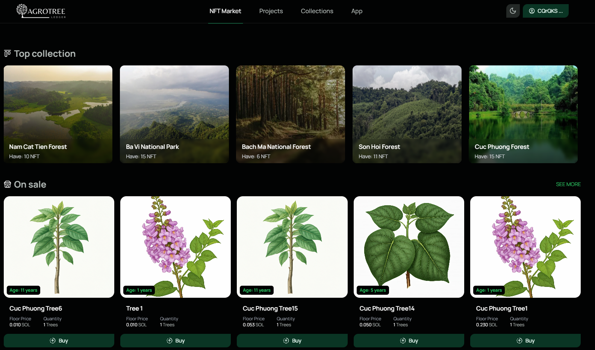

## AgroTree Ledger - Marketplace App

App: https://marketplace.soltion.store/

Video: https://player.vimeo.com/video/1017350136

[](https://player.vimeo.com/video/1017350136)

## Description

The AgroTree Ledger Marketplace App is a decentralized application that allows users to trade thier tree NFT tokens and earn. The app is built using

- Next.js
- Supabase
- Prisma
- Solana web3.js
- Metaplex SDK
- DasApi

## How to run the app

### 1. Clone the repository

```bash
git clone
```

### 2. Install dependencies

```bash
pnpm install
```

### 3. Run the app

Create a `.env.local` file in the root directory and add the environment variables

```bash
pnpm dev
```

### 4. Build the app

```bash
pnpm build
```

## How to use

### 1. Authenticate

User can authenticate using their solana wallet or social accounts (Google, Github, Twitter)

### 2. View Top collection

At the home page, user can view the top collection of tree NFTs. Click on the collection to view the details


### 3. View project

At the Project page, user can view the project details and the tree NFTs available for sale


Click on project to view the details


### 4. View tree NFT

User can click on the tree NFT to view the details


### 5. Trade NFT

User can list their tree NFT for sale or buy tree NFTs buy clicking on the action buttons on the tree NFT card.

Access profile page to manage their tree NFTs.


